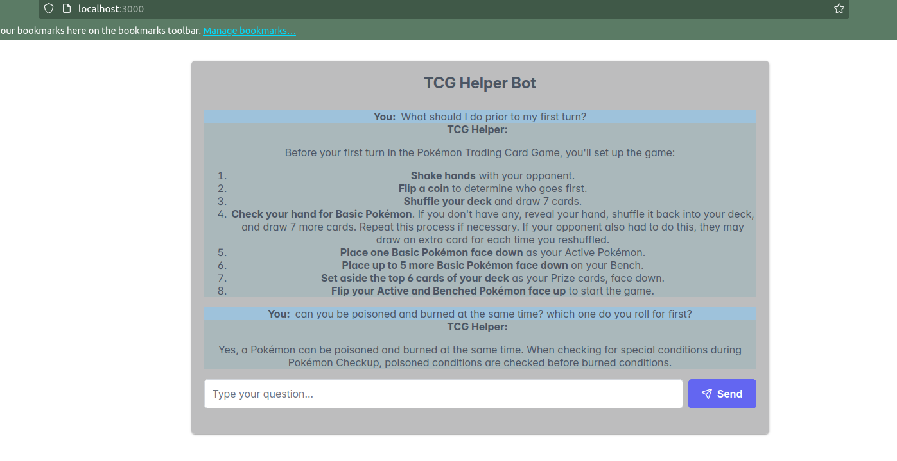

# TCG_AI

TCG_AI is an application designed to help users learn how to play Trading Card Games (TCGs) and board games. The app leverages Retrieval-Augmented Generation (RAG) technology to provide interactive guidance and answers to game-related questions.

## Features

- Interactive Q&A powered by a RAG engine
- Learn to Play
- Or Ask for clarity on rules during those confusing situations. 

## Getting Started

To use TCG_AI, set up a RAG engine in Google Cloud Platform (GCP) and connect it to the app. No additional configuration is required.

## Requirements

- Google Cloud Platform account
- RAG engine deployed in GCP

## Setup

1. Deploy a RAG engine in your GCP environment.
2. Plug the RAG engine into TCG_AI following the integration instructions.
3. Start learning and exploring TCGs and board games!

## Example 

This tool can both answer simple questions to help you get started or clear up the rules when things get confusing. 
